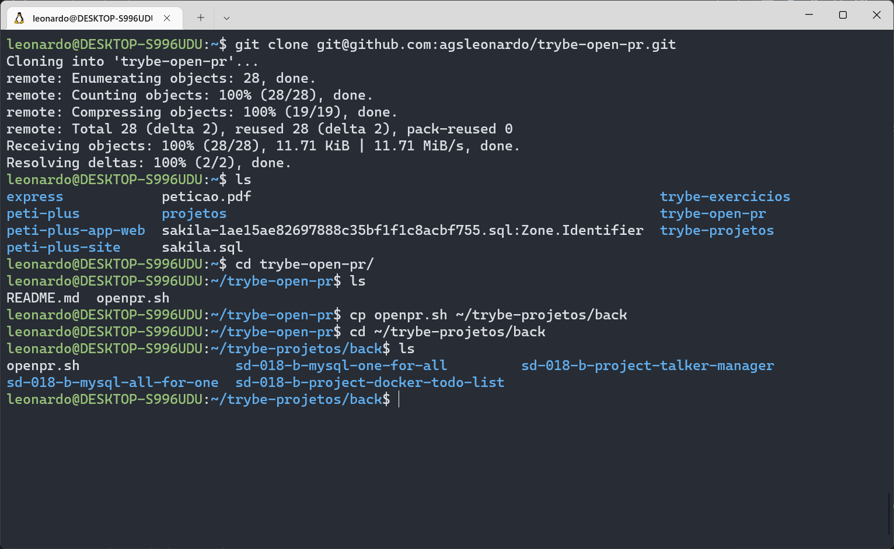
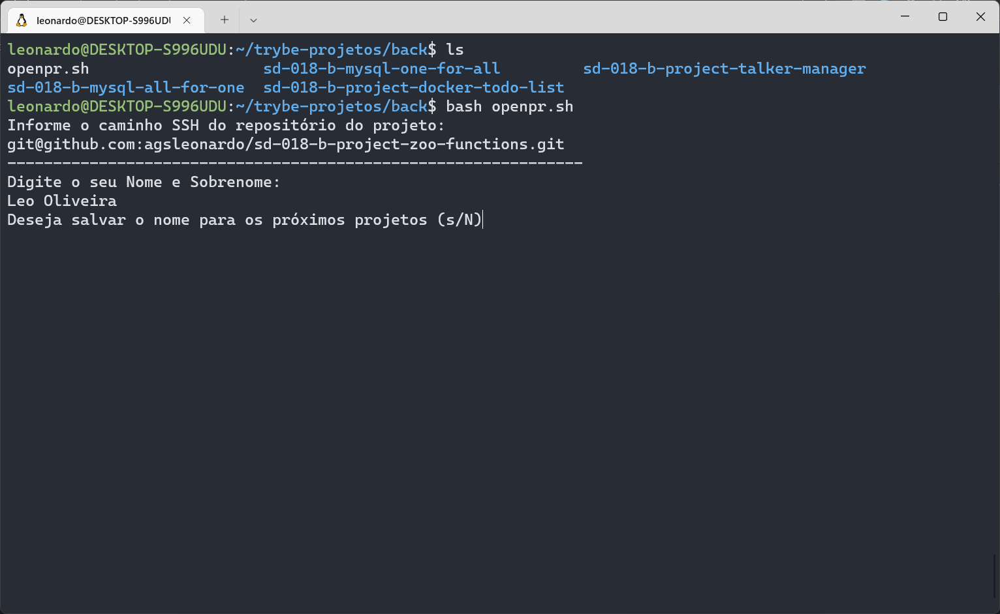
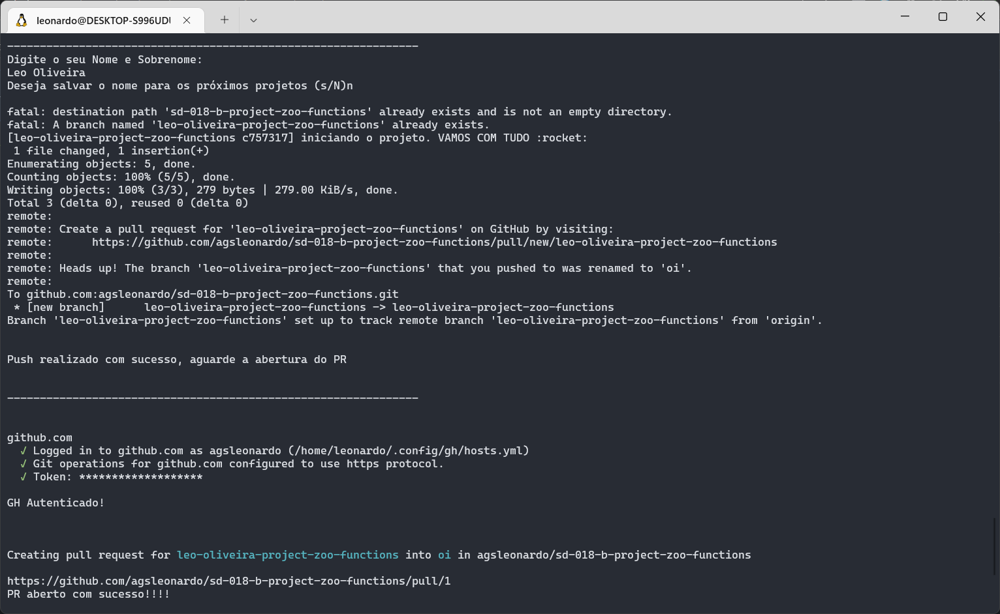
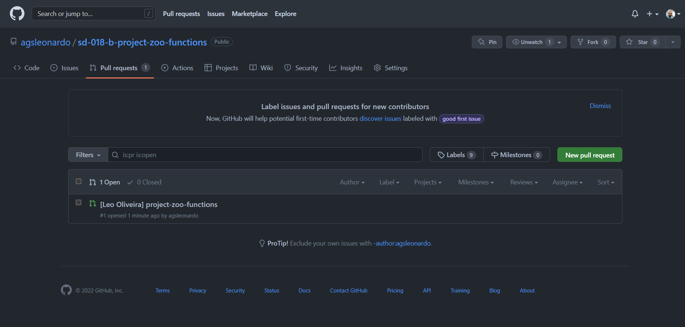

## Trybe Open PR
Este script foi desenvolvido com intuito de facilitar o processo de abertura de Pull Requests nos projetos para os alunos da Trybe.

Basicamente, o script solicita algumas informações:
- O caminho SSH do repositório (para fins de automação dos projetos da Trybe, o tratamento realizado leva em conta um input no padrão Trybe ex.: sd-xxx-x-project-lalaland). Apesar de realizar a abertura com sucesso, pode não ter o resultado esperado para outros projetos.
- O nome e sobrenome da pessoa que está abrindo o Pull Request (ex.: Leo Oliveira)
- E o token de acesso pessoal do Github (caso seja a primeira execução). O passo a passo para criação do token pode ser acompanhado no link  https://docs.github.com/pt/authentication/keeping-your-account-and-data-secure/creating-a-personal-access-token

O processo de abertura é realizado via CLI proprietária do Github (gh), que o script se encarrega de instalar caso ainda não tenha no sistema.
## Funcionalidades

- Abre o PR para os projetos da Trybe de forma automatizada.

## Como contribuir
  1. Crie um fork do projeto
  2. Crie uma branch e adicione a sua contribuição
  3. Altere o caminho de merge da sua branch para a master do projeto `agsleonardo:main`
  4. Abra uma Issue no Github, detalhando sua contribuição 
  5. Aguarde até a aprovação.

## Rodando localmente

Crie um token de acesso pessoal do GITHUB com todas as permissões

```bash
  https://docs.github.com/pt/authentication/keeping-your-account-and-data-secure/creating-a-personal-access-token
```
Clone o projeto

```bash
  git clone git@github.com:agsleonardo/trybe-open-pr.git
```

Entre no diretório do projeto

```bash
  cd trybe-open-pr
```

Copie o script para a pasta onde você armazena os projetos

```bash
  cp openpr.sh /pasta-dos-projetos
```
Entre na pasta onde você armazena os projetos

```bash
  cd /pasta-dos-projetos
```
Execute o script

```bash
  bash openpr.sh
```

## Screenshots










